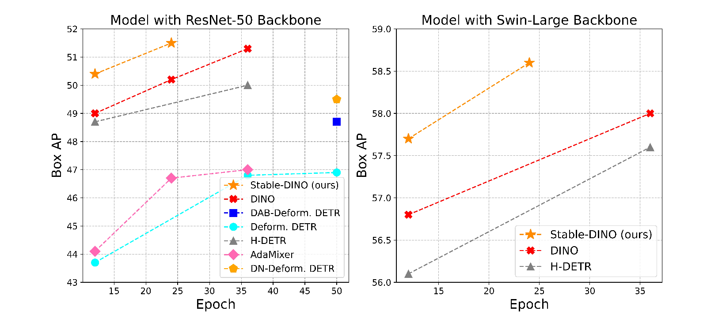
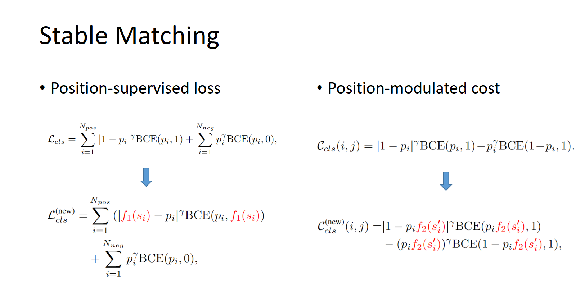
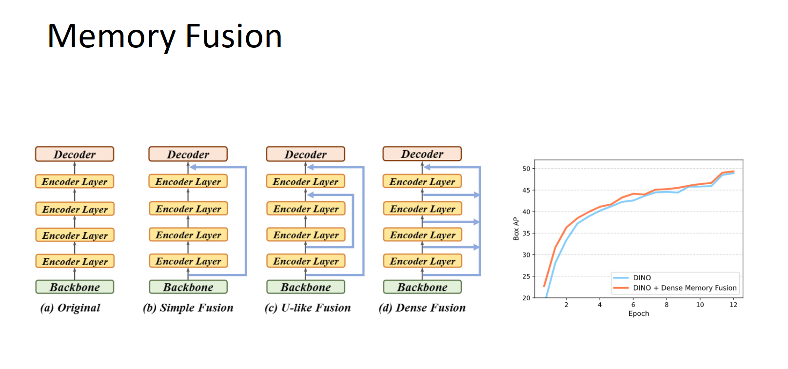
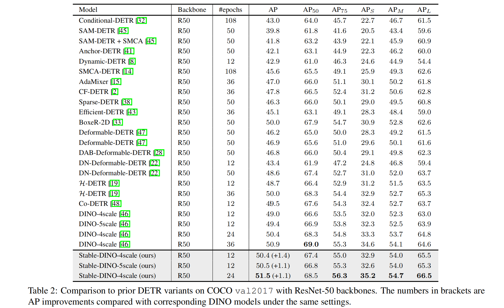
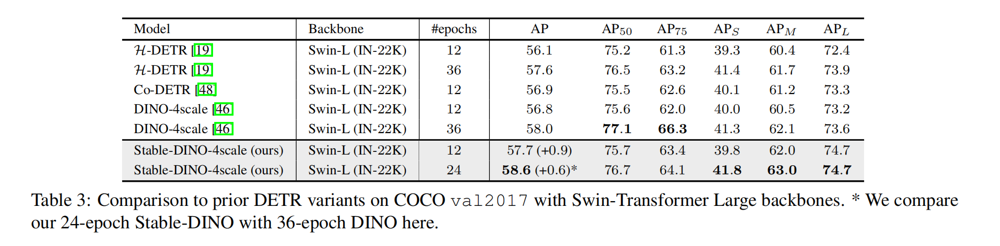
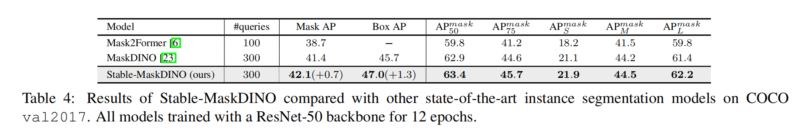

# :dragon_face: Stable DINO

## :bulb: Highlight
- **High performance.** Maybe the strongest object detector.
- **Easy to use.** Only a few lines of code to modified on DINO.
- **Lightweight.** Nearly on extra cost during training and inference compared with [DINO](https://github.com/IDEA-Research/DINO).

## :open_book: Methods:

## Results:
ResNet-50

Swin-L

Stable-MaskDINO. 

