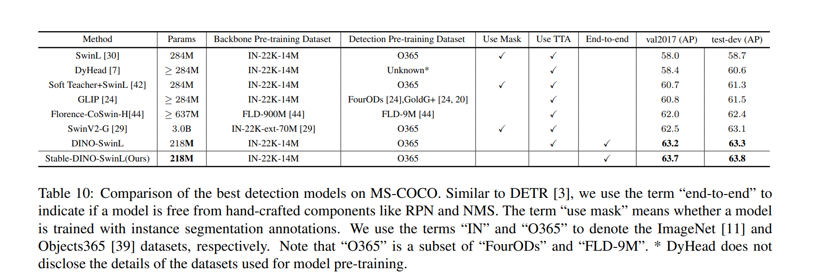
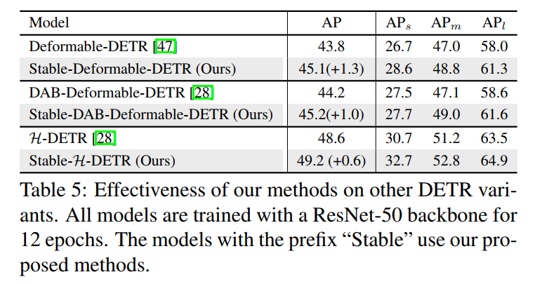

# :dragon_face: Stable-DINO

[](https://paperswithcode.com/sota/object-detection-on-coco-minival?p=a-strong-and-reproducible-object-detector) [](https://paperswithcode.com/sota/object-detection-on-coco?p=a-strong-and-reproducible-object-detector)

<h3>Detection Transformer with Stable Matching</h3>

[Shilong Liu](http://www.lsl.zone/)\*, [Tianhe Ren](https://rentainhe.github.io/)\*, [Jiayu Chen](https://github.com/tuofeilunhifi)\*, [Zhaoyang Zeng](https://scholar.google.com/citations?user=bo2FdJUAAAAJ&hl=zh-CN&oi=ao), [Hao Zhang](https://scholar.google.com/citations?user=B8hPxMQAAAAJ&hl=zh-CN), [Feng Li](https://scholar.google.com/citations?user=ybRe9GcAAAAJ&hl=zh-CN), [Hongyang Li](https://github.com/LHY-HongyangLi), [Jun Huang](https://github.com/IDEA-Research/Stable-DINO), [Hang Su](https://scholar.google.com/citations?hl=en&user=dxN1_X0AAAAJ&view_op=list_works&sortby=pubdate), [Jun Zhu](https://scholar.google.com/citations?hl=en&user=axsP38wAAAAJ), [Lei Zhang](https://www.leizhang.org/)<sup>:email:</sup>.

(\*) equal contribution, (<sup>:email:</sup>) corresponding author.

- ArXiv Preprint: [arXiv 2304.04742](https://arxiv.org/abs/2304.04742)
- Focal-Stable-DINO Technical Report: [arXiv 2304.13027](https://arxiv.org/abs/2304.13027)
- Code will be available in [detrex](https://github.com/IDEA-Research/detrex)! Stay tuned!

## :sparkles: News
- **`26 Apr, 2023`:** By combining with [FocalNet-Huge](https://github.com/microsoft/FocalNet) backbone, Focal-Stable-DINO achieves **64.8 AP** on COCO test-dev *without* any test time augmentation! Check our [Technical Report](https://arxiv.org/abs/2304.13027) for more details.
- **`12 Apr, 2023`:** Preprint our paper on [ArXiv](https://arxiv.org/abs/2304.04742)! 

## :bulb: Highlight
- **High performance.** Maybe the strongest object detector. **63.8** AP on COCO with Swin-Large backbones (only 218M parameters).
- **Easy to use.** Only a few lines of code to be modified on [DINO](https://github.com/IDEA-Research/DINO).
- **Lightweight.** Nearly no extra cost during training and inference compared with [DINO](https://github.com/IDEA-Research/DINO).
- **Generalization.** Easy to combine with the existing DETR variants and boost the performance.


## :open_book: Methods:


## :fries: Results:
- *ResNet-50 Backbone*


- *Swin-L Backbone*


- *Compare with SOTA methods*


- *Stable-MaskDINO*


<!-- - *Generalization*
 -->


## :poultry_leg: Related Projects:
- [DINO](https://github.com/IDEA-Research/DINO)
- [Mask DINO](https://github.com/IDEA-Research/MaskDINO)
- [Grounding DINO](https://github.com/IDEA-Research/GroundingDINO)
- [DN-DETR](https://github.com/IDEA-Research/DN-DETR)
- [DAB-DETR](https://github.com/IDEA-Research/DAB-DETR)

## :avocado: Bibtex
```bibtex
@misc{liu2023detection,
      title={Detection Transformer with Stable Matching}, 
      author={Shilong Liu and Tianhe Ren and Jiayu Chen and Zhaoyang Zeng and Hao Zhang and Feng Li and Hongyang Li and Jun Huang and Hang Su and Jun Zhu and Lei Zhang},
      year={2023},
      eprint={2304.04742},
      archivePrefix={arXiv},
      primaryClass={cs.CV}
}
```
