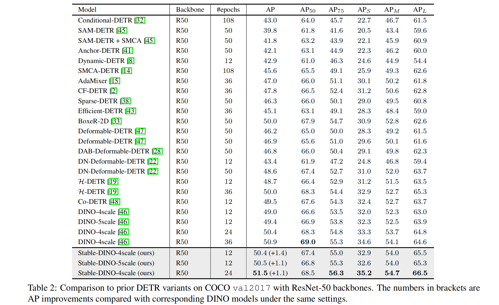
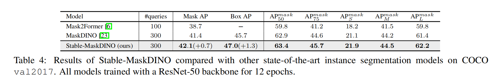

<div align="center">
  
</div>

<h2 align="center"> :dragon_face: Stable-DINO: Detection Transformer with Stable Matching </h2>

<div align="left">
  
[](https://paperswithcode.com/sota/object-detection-on-coco-minival?p=a-strong-and-reproducible-object-detector) [](https://paperswithcode.com/sota/object-detection-on-coco?p=a-strong-and-reproducible-object-detector)

</div>

**[IDEA-CVR, IDEA-Research](https://github.com/IDEA-Research)** 

[Shilong Liu](http://www.lsl.zone/)\*, [Tianhe Ren](https://rentainhe.github.io/)\*, [Jiayu Chen](https://github.com/tuofeilunhifi)\*, [Zhaoyang Zeng](https://scholar.google.com/citations?user=U_cvvUwAAAAJ&hl=zh-CN&oi=ao), [Hao Zhang](https://scholar.google.com/citations?user=B8hPxMQAAAAJ&hl=zh-CN), [Feng Li](https://scholar.google.com/citations?user=ybRe9GcAAAAJ&hl=zh-CN), [Hongyang Li](https://github.com/LHY-HongyangLi), [Jun Huang](https://github.com/IDEA-Research/Stable-DINO), [Hang Su](https://scholar.google.com/citations?hl=en&user=dxN1_X0AAAAJ&view_op=list_works&sortby=pubdate), [Jun Zhu](https://scholar.google.com/citations?hl=en&user=axsP38wAAAAJ), [Lei Zhang](https://www.leizhang.org/)<sup>:email:</sup>.

(\*) equal contribution, (<sup>:email:</sup>) corresponding author.

[[`Stable-DINO Paper`](https://arxiv.org/abs/2304.04742)] [[`Focal-Stable-DINO Report`](https://arxiv.org/abs/2304.13027)] [[`BibTex`](#avocado-citing-stable-dino)] [[`Code in detrex`](https://github.com/IDEA-Research/Stable-DINO)]

<!-- - Stable-DINO ArXiv Preprint: [arXiv 2304.04742](https://arxiv.org/abs/2304.04742)
- Focal-Stable-DINO Technical Report: [arXiv 2304.13027](https://arxiv.org/abs/2304.13027)
- Code will be available in [detrex](https://github.com/IDEA-Research/detrex)! Stay tuned! -->

## :sparkles: News
- **`14 Jul, 2023`:** Stable-DINO is accepted to ICCV 2023!
- **`26 Apr, 2023`:** By combining with [FocalNet-Huge](https://github.com/microsoft/FocalNet) backbone, Focal-Stable-DINO achieves **64.6 AP** on COCO val2017 and **64.8 AP** on [COCO test-dev](https://codalab.lisn.upsaclay.fr/competitions/7384#results) *without* any test time augmentation! Check our [Technical Report](https://arxiv.org/abs/2304.13027) for more details.
- **`12 Apr, 2023`:** Preprint our paper on [ArXiv](https://arxiv.org/abs/2304.04742)! 

## :bulb: Highlight
- **High performance.** Maybe the strongest object detector. **63.8** AP on COCO with Swin-Large backbones (only 218M parameters).
- **Scalable.** Combining with larger backbone FocalNet-Huge (only 689M parameters), Stable-DINO still improves the performance to **64.6 AP** on COCO val2017 and **64.8 AP** on COCO test-dev *without* any test time augmentation.
- **Easy to use.** Only a few lines of code to be modified on [DINO](https://github.com/IDEA-Research/DINO).
- **Lightweight.** Nearly no extra cost during training and inference compared with [DINO](https://github.com/IDEA-Research/DINO).
- **Generalization.** Easy to combine with the existing DETR variants and boost the performance.


## :open_book: Methods:


## :fries: Results:
- *ResNet-50 Backbone*


- *Swin-L Backbone*


- *Compare with SOTA methods*


- *Stable-MaskDINO*


<!-- - *Generalization*
 -->

## Run
Our code is implemented on [detrex](https://github.com/IDEA-Research/detrex).

1. Install detrex and data preparation

Please follow the [detrex instruction](https://detrex.readthedocs.io/en/latest/tutorials/Installation.html) for installation and data preparation.

2. Training scripts

We provide a training example of Stable DINO R50. Refer to the [detrex doc](https://detrex.readthedocs.io/en/latest/tutorials/Getting_Started.html) for more details

```bash
CUDA_VISIBLE_DEVICES=0 \
python tools/train_net.py \
    --config-file projects/stabledino/configs/stabledino_r50_4scale_12ep.py \
    --num-gpus 1 \
    dataloader.train.total_batch_size=4 \
    train.output_dir="./output/stabledino_r50_4scale_12ep" \
    train.test_with_nms=0.80 
```


## :poultry_leg: Related Projects:
- [DINO](https://github.com/IDEA-Research/DINO)
- [Mask DINO](https://github.com/IDEA-Research/MaskDINO)
- [Grounding DINO](https://github.com/IDEA-Research/GroundingDINO)
- [DN-DETR](https://github.com/IDEA-Research/DN-DETR)
- [DAB-DETR](https://github.com/IDEA-Research/DAB-DETR)

## :avocado: Citing Stable-DINO
If you use Stable-DINO in your research or wish to refer to the baseline results published here, please use the following BibTeX entry.

```BibTeX
@misc{liu2023detection,
      title={Detection Transformer with Stable Matching}, 
      author={Shilong Liu and Tianhe Ren and Jiayu Chen and Zhaoyang Zeng and Hao Zhang and Feng Li and Hongyang Li and Jun Huang and Hang Su and Jun Zhu and Lei Zhang},
      year={2023},
      eprint={2304.04742},
      archivePrefix={arXiv},
      primaryClass={cs.CV}
}
```

```BibTeX
@misc{ren2023strong,
      title={A Strong and Reproducible Object Detector with Only Public Datasets}, 
      author={Tianhe Ren and Jianwei Yang and Shilong Liu and Ailing Zeng and Feng Li and Hao Zhang and Hongyang Li and Zhaoyang Zeng and Lei Zhang},
      year={2023},
      eprint={2304.13027},
      archivePrefix={arXiv},
      primaryClass={cs.CV}
}
```
